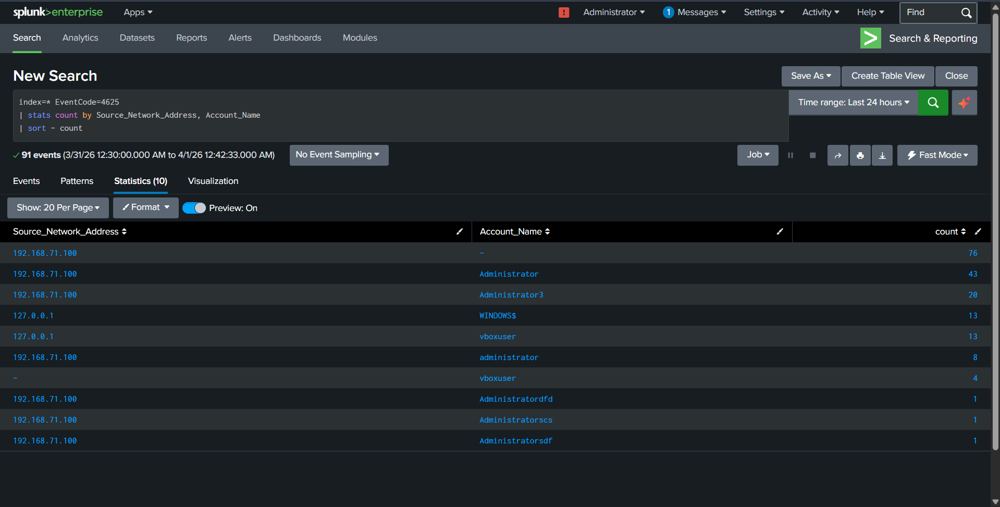

# 🔐 SOC Brute Force Detection using Splunk

## 📌 Project Overview

This project demonstrates detection of brute-force login attacks using Splunk SIEM. It simulates an attacker attempting unauthorized access and shows how logs are collected, analyzed, and monitored in a SOC environment.

---

## 🏗 Architecture

---

## 📥 Data Collection

Logs are collected from the Windows system using Splunk Universal Forwarder.

---

## 📊 Log Ingestion

Windows Security logs (Event ID 4625) are ingested into Splunk.

---

## 🚨 Detection

Brute-force login attempts are detected using Splunk queries.

---

## 📈 Visualization

A dashboard is created to monitor failed login attempts.

---

## 🛠 Troubleshooting

### ❌ No Results Issue

Search returned no results due to incorrect time range or missing data.

---

### ❌ Forwarder Log Error

Forwarder encountered log access or configuration issues.

---

### ❌ No Events Found

No logs were ingested due to misconfiguration.

---

## ⚙️ Technologies Used

* Splunk Enterprise
* Splunk Universal Forwarder
* Windows Event Logs
* Kali Linux (Attack Simulation)

---

## 🎯 Outcome

* Simulated brute-force attack successfully
* Detected failed login attempts (Event ID 4625)
* Created alerts for monitoring
* Built dashboard for visualization
* Demonstrated SOC workflow from detection to response
