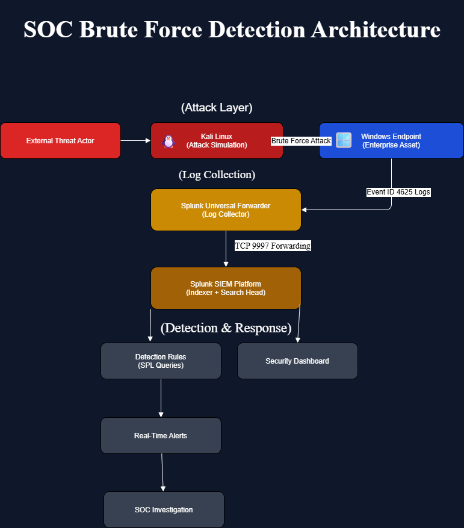
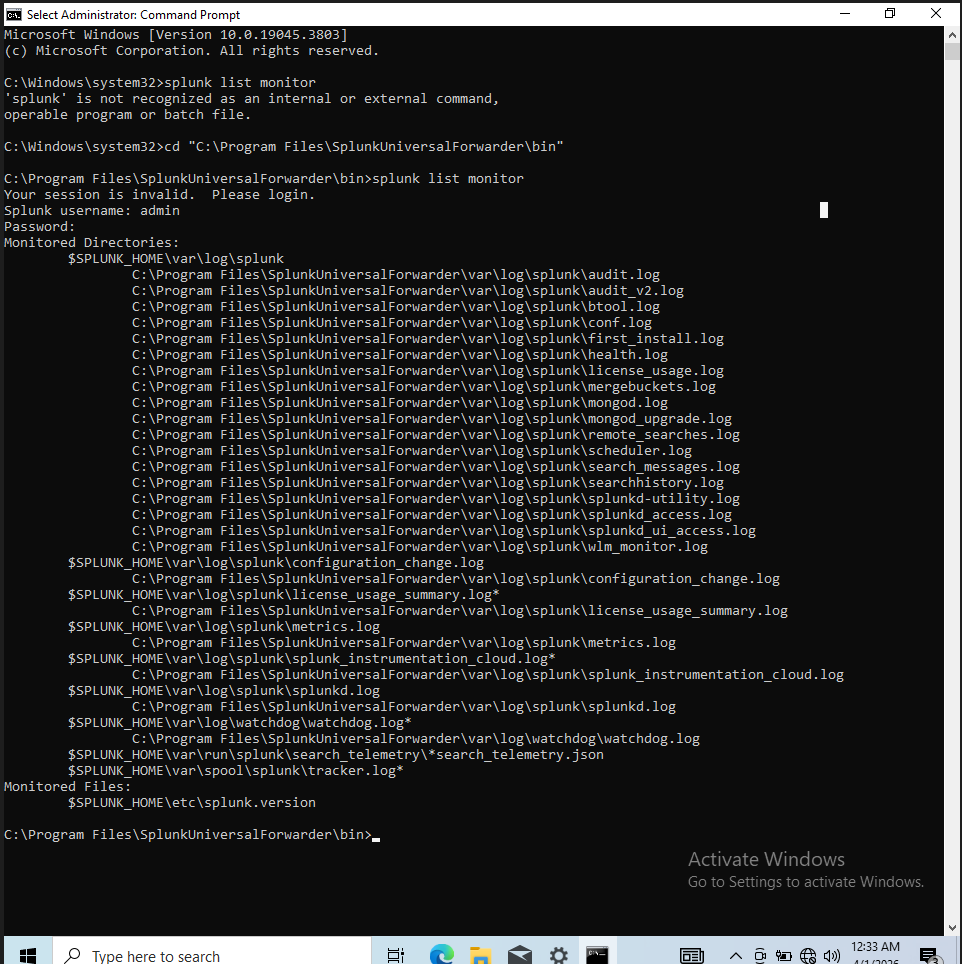
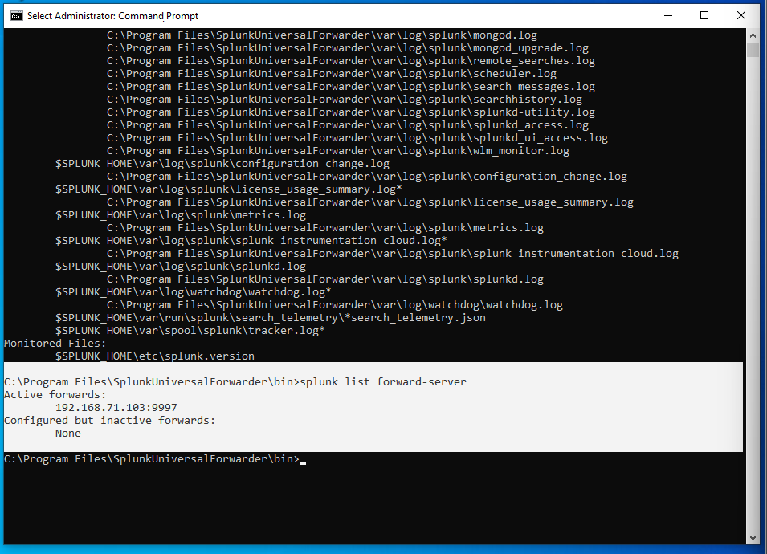
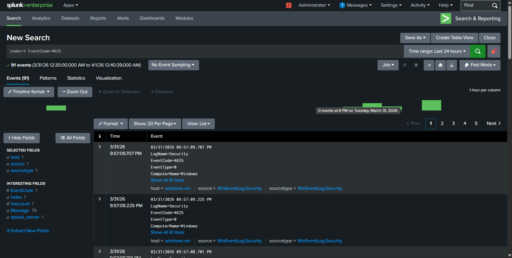
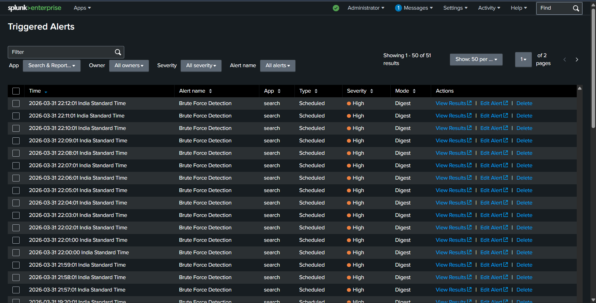
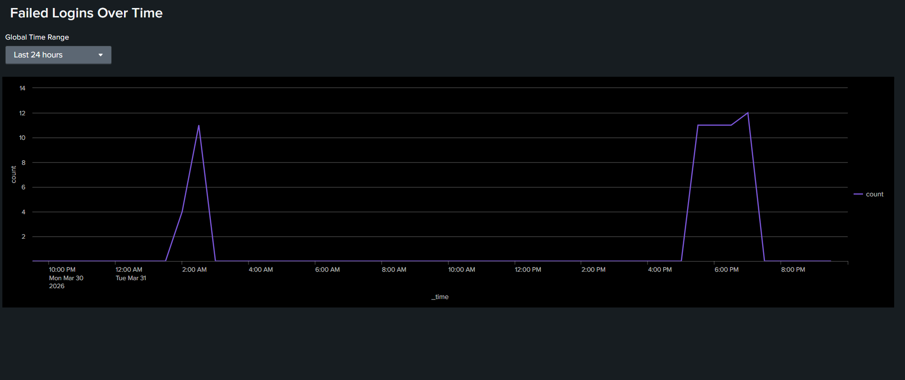
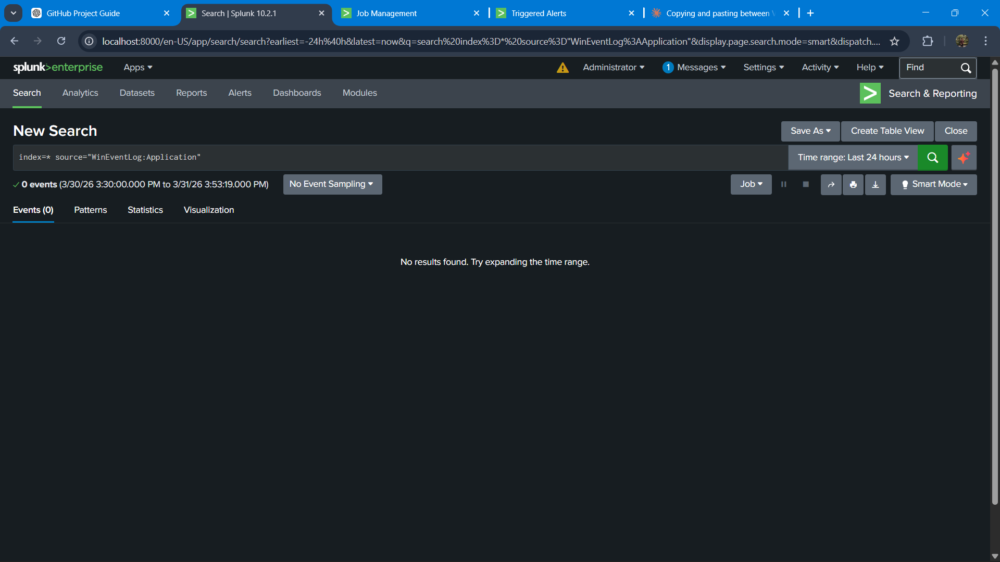
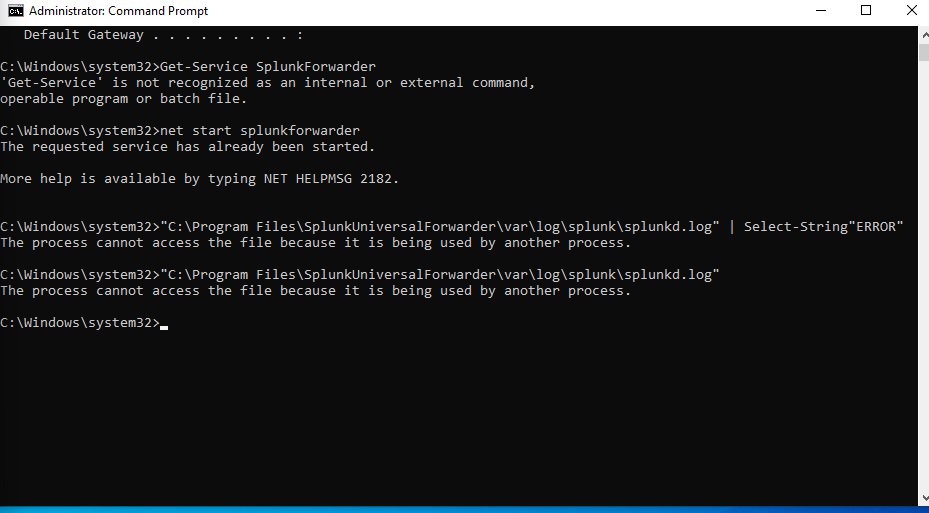
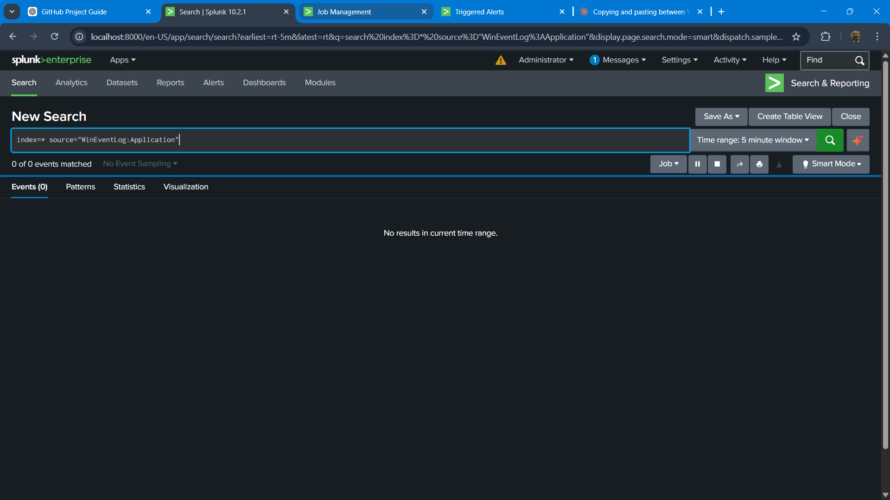

# 🔐 SOC Brute Force Detection using Splunk

## 📌 Overview

This project simulates a brute-force attack in a controlled lab environment and demonstrates how a Security Operations Center (SOC) detects, analyzes, and monitors such activity using Splunk SIEM.

The objective is to build an end-to-end detection pipeline—from log collection to alerting and visualization—mimicking real-world SOC operations.

---

## 🧱 Architecture



---

## 🎯 Use Case

A brute-force attack involves repeated login attempts using incorrect credentials to gain unauthorized access.

In Windows systems, each failed login generates **Event ID 4625**, which is critical for detecting such attacks.

This project uses Event ID 4625 to:

* Identify attacker IP addresses
* Detect repeated login failures
* Monitor suspicious authentication patterns

---

## ⚙️ Lab Setup

### 🔹 Components

* **Kali Linux** → Attack simulation
* **Windows Endpoint** → Target system
* **Splunk Universal Forwarder** → Log collection
* **Splunk Enterprise (SIEM)** → Log analysis & detection

---

## 🔄 Data Flow

1. Attacker performs brute-force attempts from Kali Linux
2. Windows system generates **Event ID 4625** logs
3. Logs are collected via Universal Forwarder
4. Logs are forwarded to Splunk (Port 9997)
5. Splunk indexes and analyzes logs
6. Detection rules identify suspicious behavior
7. Alerts are generated
8. Dashboard visualizes attack patterns

---

## 📥 Data Collection




Logs are collected from Windows Event Logs using Splunk Universal Forwarder.

---

## 📊 Log Ingestion



Successful ingestion of Windows Security logs (Event ID 4625) into Splunk.

---

## 🔍 Detection Logic

### SPL Query

```
index=* EventCode=4625
| stats count by Source_Network_Address, Account_Name
| sort - count
```

### 🔎 What This Detects

* High number of failed login attempts
* Source IP generating suspicious traffic
* Targeted user accounts

This helps identify brute-force attack behavior.

---

## 🚨 Alerting



Alerts are configured to trigger when suspicious login patterns are detected.

---

## 📈 Visualization



A dashboard provides:

* Failed login trends over time
* Attack spikes
* Monitoring visibility for SOC analysts

---

## 🛠 Troubleshooting

### ❌ No Results Issue



**Cause:** Incorrect time range or no data ingestion
**Fix:** Adjust time range and verify log forwarding

---

### ❌ Forwarder Log Error



**Cause:** Log file access or service issues
**Fix:** Restart forwarder and verify configuration

---

### ❌ No Events Found



**Cause:** Misconfigured inputs.conf or indexing issue
**Fix:** Validate configuration and restart services

---

## 🧠 Key Learnings

* Understanding Windows Security Event Logs (Event ID 4625)
* Configuring Splunk Universal Forwarder
* Writing SPL queries for threat detection
* Creating alerts and dashboards
* Troubleshooting log ingestion issues
* Understanding SOC workflow

---

## 🚀 Future Improvements

* Implement threshold-based brute-force detection
* Add correlation rules
* Integrate Sysmon logs
* Map detections to MITRE ATT&CK
* Automate incident response workflows

---

## 🎯 Outcome

This project successfully demonstrates:

* Detection of brute-force attacks using Splunk
* Real-time monitoring and alerting
* SOC-style investigation workflow

It reflects practical skills required for a **SOC Analyst (L1)** role.
